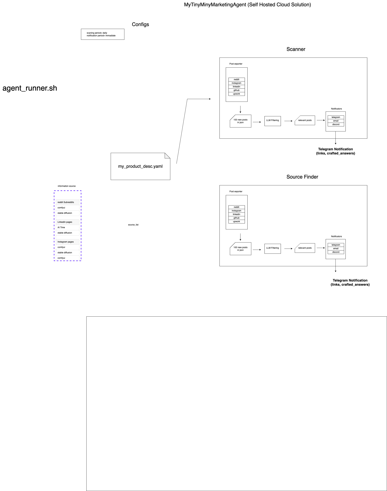

# mytinyminymarketingagent

is a dev-friendly open-source tool designed for marketing and content promotion assistance, which can be effortlessly deployed. 
Its primary function is to utilize Large Language Models (LLMs) to meticulously search through various forums, web pages, and social media platforms for content that's highly relevant to your product/project/media content (freshly created YouTube tutorial, a blog post, a code repository, or an innovative startup concept)

Mytinyminymarketingagent aims to find and aggregate links to discussions pertinent to what you're offering. This enables you to directly engage with and guide potential customers/viewers to your product/project/media with ease. The links that are found will be conveniently delivered to the users of Mytinyminymarketingagent via their preferred communication channels, including email, Telegram, or Discord.

# How to use 
## self hosted
1. Use your local machine or create a really cheap cloud VM (ubuntu)
2. git clone this repo
3. Edit the example yaml file (my_project_desc.yaml) with your own product/content description
4. Create a gpt4 token (in the future we will use a local LLM for cutting the cost)
5. message @mytinyminymarketingagent in telegram and visit https://api.telegram.org/bot7150938476:AAGrbkdDXJzZxXVyLBsbBe8YHaXD7cBY85Q/getUpdates to learn your id 
6. edit env variables accordingly with your credantials (token and chat id) 
7. edit generic_config.yaml file for your desire
8. edit information_source.yaml file with your knowledge
9. run the program and get telegram notifications of relevant products
10. Promote your product/content manually or by editing the GPT generated answer

## managed
